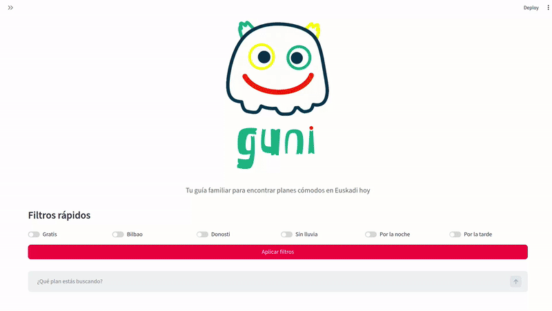

---

**Author:** Danillo Barros de Souza

**ORCID:** [0000-0002-7792-8862](https://orcid.org/0000-0002-7792-8862)

---

# GuniCHat

<p align="center">
  
</p>

<p align="center">
  
</p>

<p align="center">
  <strong>Asistente conversacional para descubrir eventos culturales en Euskadi mediante lenguaje natural.</strong>
</p>

<p align="center">
  <a href="https://gunisimple.streamlit.app/">🚀 Demo online</a>
</p>

---


## 📌 Descripción

**GuniCHat** es un buscador conversacional de eventos culturales en Euskadi que permite consultar información utilizando **lenguaje natural**, sin necesidad de construir consultas estructuradas ni conocer los campos internos de los datos.

La aplicación combina datos abiertos de **Euskadi.eus** con información meteorológica proporcionada por **Open-Meteo**, generando un conjunto de datos enriquecido que posteriormente puede ser consultado mediante lenguaje natural.

Por ejemplo, el usuario puede escribir:

> *"Eventos gratis en Bilbao para hoy"*

o realizar consultas más específicas:

> *"Conciertos en Bilbao mañana con poca lluvia"*

> *"Eventos hasta 10 euros con una temperatura máxima de 20 grados"*

El sistema interpreta la consulta, identifica los criterios relevantes y aplica automáticamente los filtros correspondientes sobre los datos de eventos.

La aplicación está desplegada utilizando **Streamlit** y puede probarse directamente online:

**🌐 ****[GuniCHat — Demo](https://gunisimple.streamlit.app/)**

---

## ✨ Características

* 🔎 **Búsqueda en lenguaje natural**
* 🇪🇸 Soporte para consultas en español
* 🌦️ Integración con datos meteorológicos de **Open-Meteo**
* 🏛️ Consulta de eventos culturales de **Euskadi.eus**
* 🐼 Procesamiento de datos mediante **Pandas**
* 🧠 Interpretación de consultas mediante **NLP con spaCy**
* 🤖 Versiones anteriores experimentales utilizando **LLM locales mediante Ollama**
* 💶 Filtrado por precio
* 📅 Filtrado por fecha
* 📍 Filtrado por municipio
* 🎭 Filtrado por tipo de evento
* 🌧️ Filtrado por probabilidad de precipitación
* 🌡️ Filtrado por temperatura
* 💻 Aplicación web desarrollada con **Streamlit**
* ⚡ Procesamiento local, sin necesidad de servicios LLM externos en la versión actual
* 📝 Presentación de resultados en formato Markdown

---

# 🧠 Procesamiento mediante lenguaje natural

La versión actual de GuniCHat utiliza **spaCy** para analizar la consulta del usuario y detectar diferentes tipos de información.

El objetivo es transformar una consulta en lenguaje natural en una expresión de filtrado que pueda aplicarse directamente sobre un `DataFrame` de Pandas.

Por ejemplo:

```text
Eventos gratis en Bilbao para hoy
```

se transforma conceptualmente en filtros equivalentes a:

```python
I[
    (I["municipalityEs"].fillna("").str.lower() == "bilbao") &
    (pd.to_datetime(I["startDate"], errors="coerce").dt.date
        == pd.Timestamp.today().date()) &
    (I["priceEs"].fillna("").str.lower()
        .str.contains("gratis|gratuito"))
]
```

De esta manera, el sistema separa dos etapas:

```text
Lenguaje natural
       ↓
Interpretación NLP
       ↓
Filtros estructurados
       ↓
Pandas DataFrame
       ↓
Resultados
```

Esto permite realizar consultas relativamente complejas sin que el usuario tenga que conocer la estructura del dataset.

---

# 🔍 Tipos de consultas

GuniCHat reconoce actualmente diferentes criterios de búsqueda.

### 📍 Localización

```text
Eventos en Bilbao
```

```text
Conciertos en Donostia
```

El sistema busca coincidencias con los municipios disponibles en los datos.

### 📅 Fecha

```text
Eventos para hoy
```

```text
Eventos para mañana
```

### 💶 Precio

Es posible utilizar expresiones como:

```text
Eventos hasta 10 euros
```

```text
Eventos por debajo de 20 euros
```

```text
Eventos con un precio máximo de 15 euros
```

### 🎭 Tipo de evento

Algunos ejemplos:

```text
Conciertos en Bilbao
```

```text
Eventos de teatro
```

```text
Exposiciones
```

```text
Festivales
```

```text
Talleres
```

### 💻 Eventos online

```text
Eventos online
```

### 🌧️ Precipitación

El sistema también puede utilizar información meteorológica para restringir los resultados:

```text
Eventos con poca lluvia
```

```text
Eventos con baja precipitación
```

```text
Eventos con precipitación menor de 30%
```

Cuando se utiliza una expresión como *"poca lluvia"*, se aplica un umbral predeterminado sobre la probabilidad de precipitación.

### 🌡️ Temperatura

También es posible consultar eventos en función de la temperatura prevista:

```text
Eventos hasta 20 grados
```

```text
Eventos con temperatura máxima de 18 grados
```

---

# 🌦️ Integración meteorológica

Una de las características de GuniCHat es el **enriquecimiento de los datos de eventos con información meteorológica**.

El sistema obtiene información de **Open-Meteo** y la incorpora al conjunto de datos de eventos.

Esto permite combinar información originalmente independiente:

```text
Eventos Euskadi.eus
        +
Información meteorológica
        ↓
Dataset enriquecido
        ↓
Búsqueda mediante lenguaje natural
```

Por ejemplo, una consulta como:

```text
¿Qué eventos hay mañana en Bilbao si no llueve mucho?
```

puede utilizar simultáneamente:

* municipio
* fecha
* probabilidad de precipitación

---

# 🏗️ Arquitectura

El proyecto ha evolucionado a través de diferentes versiones de procesamiento de lenguaje natural.

La arquitectura conceptual de la aplicación actual es:

```text
                    ┌───────────────────┐
                    │      Usuario      │
                    └─────────┬─────────┘
                              │
                              ▼
                    Consulta en lenguaje
                         natural
                              │
                              ▼
                    ┌───────────────────┐
                    │      spaCy        │
                    │   NLP processing  │
                    └─────────┬─────────┘
                              │
                              ▼
                    ┌───────────────────┐
                    │  Filter builder   │
                    │                  │
                    │ municipio        │
                    │ fecha            │
                    │ precio           │
                    │ tipo             │
                    │ temperatura      │
                    │ precipitación    │
                    └─────────┬─────────┘
                              │
                              ▼
                    ┌───────────────────┐
                    │ Pandas DataFrame  │
                    │       (I)         │
                    └─────────┬─────────┘
                              │
                              ▼
                    ┌───────────────────┐
                    │ Filtrado de datos │
                    └─────────┬─────────┘
                              │
                              ▼
                    ┌───────────────────┐
                    │ Resultados en     │
                    │ Markdown          │
                    └───────────────────┘
```

---

# 🔄 Flujo de datos

Un ejemplo completo del procesamiento sería:

```text
Usuario:
"Eventos gratis en Bilbao para hoy"
          │
          ▼
      Streamlit
          │
          ▼
   Consulta NLP
          │
          ▼
      spaCy
          │
          ├── Municipio → Bilbao
          ├── Fecha → Hoy
          └── Precio → Gratis
          │
          ▼
  DataFrame de eventos
          │
          ▼
      Aplicación
      de filtros
          │
          ▼
    Eventos encontrados
          │
          ▼
    Formateo Markdown
          │
          ▼
      Respuesta
```

---

# 🤖 Evolución del sistema NLP

El proyecto incluye diferentes implementaciones que permiten experimentar con distintas estrategias de interpretación de lenguaje natural.

## Versión basada en LLM

Las primeras versiones utilizaron un **modelo de lenguaje local mediante Ollama**.

El flujo era:

```text
Consulta del usuario
        ↓
      Ollama
        ↓
Interpretación de la consulta
        ↓
Generación de expresión Pandas
        ↓
Aplicación del filtro
```

Por ejemplo, el modelo podía transformar:

```text
Eventos gratis en Bilbao
```

en una expresión equivalente a:

```python
I[
    (I["municipalityEs"] == "Bilbao") &
    (I["price"] == 0)
]
```

Esta aproximación permite una interpretación más flexible del lenguaje, pero introduce una dependencia adicional de un modelo de lenguaje.

## Versión actual: spaCy

La versión más reciente sustituye esta etapa por un enfoque basado en **NLP determinista con spaCy y reglas de extracción**.

Esto permite:

* reducir las dependencias computacionales;
* evitar la necesidad de ejecutar un LLM;
* obtener filtros reproducibles;
* controlar explícitamente las expresiones reconocidas;
* ejecutar el procesamiento completamente de forma local.

Actualmente se utiliza:

```python
nlp = spacy.load("es_core_news_sm")
```

y posteriormente se combinan análisis NLP con expresiones regulares y reglas específicas del dominio.

---

# 📊 Datos

El proyecto utiliza información de eventos culturales procedente de fuentes abiertas de **Euskadi.eus**.

Los datos son transformados en un `DataFrame` de Pandas que contiene información como:

* nombre del evento;
* municipio;
* fecha de inicio;
* precio;
* idioma;
* tipo de evento;
* modalidad online;
* información meteorológica.

El archivo:

```text
events_weather.csv
```

contiene una versión preprocesada y enriquecida de los datos que puede utilizarse para experimentar con el sistema.

---

# 🛠️ Tecnologías

| Tecnología      | Utilización                                  |
| --------------- | -------------------------------------------- |
| **Python**      | Lenguaje principal                           |
| **Streamlit**   | Interfaz web                                 |
| **Pandas**      | Manipulación y filtrado de datos             |
| **spaCy**       | Procesamiento de lenguaje natural            |
| **Open-Meteo**  | Datos meteorológicos                         |
| **Euskadi.eus** | Datos de eventos                             |
| **Flask**       | API REST utilizada en versiones del proyecto |
| **Ollama**      | LLM local utilizado en versiones anteriores  |
| **Jupyter**     | Experimentación y análisis                   |

---

# 📁 Estructura del proyecto

```text
GuniCHat/
│
├── API_LLM.py
├── API_LLM_v2.py
├── API_LLM_v3.py
│
├── gunichat.py
├── gunichat_simple.py
│
├── Guni_studio.ipynb
│
├── events_weather.csv
│
├── guni.png
├── gunichat_example.gif
│
├── requirements.txt
├── LICENSE
└── README.md
```

### Principales archivos

**`gunichat_simple.py`**

Aplicación Streamlit simplificada y basada en NLP con spaCy.

**`gunichat.py`**

Versión más completa de la interfaz conversacional.

**`API_LLM.py`**** / ****`API_LLM_v2.py`**** / ****`API_LLM_v3.py`**

Diferentes versiones de la arquitectura de procesamiento basada en API/LLM desarrolladas durante la evolución del proyecto.

**`Guni_studio.ipynb`**

Notebook utilizado para experimentación y desarrollo.

**`events_weather.csv`**

Dataset de eventos enriquecido con información meteorológica.

**`gunichat_example.gif`**

Demostración de funcionamiento de la aplicación.

---

# 🚀 Instalación y ejecución

## 1. Clonar el repositorio

```bash
git clone <URL_DEL_REPOSITORIO>
cd GuniCHat
```

## 2. Crear un entorno virtual

Se recomienda utilizar un entorno virtual para mantener aisladas las dependencias:

```bash
python3 -m venv .venv
```

Activarlo:

```bash
source .venv/bin/activate
```

En Windows:

```powershell
.venv\Scripts\activate
```

## 3. Instalar las dependencias

```bash
pip install -r requirements.txt
```

## 4. Instalar el modelo de spaCy

La versión actual utiliza el modelo español `es_core_news_sm`:

```bash
python -m spacy download es_core_news_sm
```

## 5. Ejecutar GuniCHat

Para ejecutar la versión simplificada:

```bash
streamlit run gunichat_simple.py
```

Streamlit abrirá automáticamente la aplicación en el navegador.

También puede accederse normalmente desde:

```text
http://localhost:8501
```

---

# ☁️ Aplicación online

GuniCHat está desplegado en Streamlit y puede probarse sin instalar el proyecto localmente:

**🚀 ****[Abrir GuniCHat](https://gunisimple.streamlit.app/)**

---

# 🧪 Ejemplos

Algunas consultas que pueden probarse directamente en la aplicación:

```text
Eventos gratis en Bilbao para hoy
```

```text
Conciertos en Bilbao
```

```text
Eventos de teatro mañana
```

```text
Exposiciones hasta 10 euros
```

```text
Eventos en Bilbao con poca lluvia
```

```text
Eventos hasta 20 euros y menos de 20 grados
```

```text
Eventos online
```

La combinación de diferentes criterios permite construir consultas más específicas sin utilizar sintaxis de programación.

---

# 🔬 Posibles extensiones

GuniCHat está diseñado como un proyecto experimental y puede extenderse en diferentes direcciones:

* ampliar el soporte multilingüe para **euskera**;
* incorporar más tipos de eventos;
* mejorar la extracción de entidades mediante NLP;
* incorporar reconocimiento de rangos de fechas;
* añadir filtros por distancia;
* incorporar geolocalización;
* utilizar embeddings para búsqueda semántica;
* incorporar sistemas de recomendación;
* añadir memoria de conversaciones;
* mejorar la integración con APIs externas;
* incorporar modelos LLM opcionales para consultas más complejas;
* desarrollar una arquitectura híbrida **NLP + LLM + búsqueda estructurada**.

Una posible evolución sería:

```text
                 Consulta del usuario
                         │
                         ▼
                ┌─────────────────┐
                │  NLP / spaCy    │
                └────────┬────────┘
                         │
             ¿Consulta estructurada?
                    /           \
                  Sí             No
                  │               │
                  ▼               ▼
             Filtros          LLM local
             directos             │
                  │               │
                  └───────┬───────┘
                          ▼
                  Búsqueda estructurada
                          │
                          ▼
                   Eventos + clima
                          │
                          ▼
                      Respuesta
```

Este enfoque híbrido permitiría mantener un procesamiento ligero para consultas sencillas y utilizar modelos de lenguaje únicamente cuando la consulta requiera una interpretación más compleja.

---

# 👨‍💻 Autor

**Danillo Barros de Souza**

**ORCID:** [0000-0002-7792-8862](https://orcid.org/0000-0002-7792-8862)

---

# 📄 Licencia

Este proyecto se distribuye bajo los términos especificados en el archivo [`LICENSE`](LICENSE).
